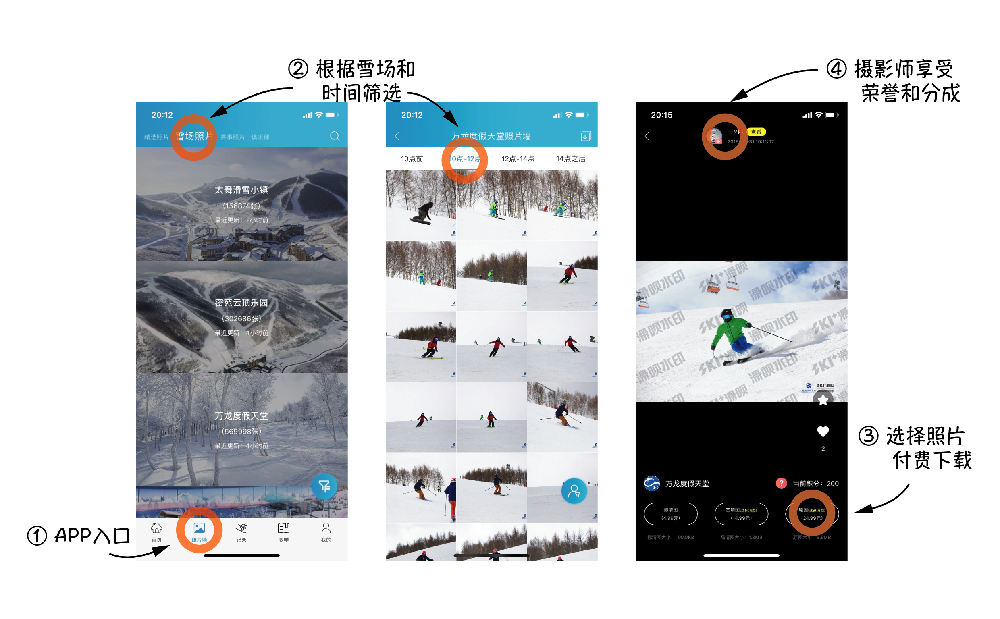
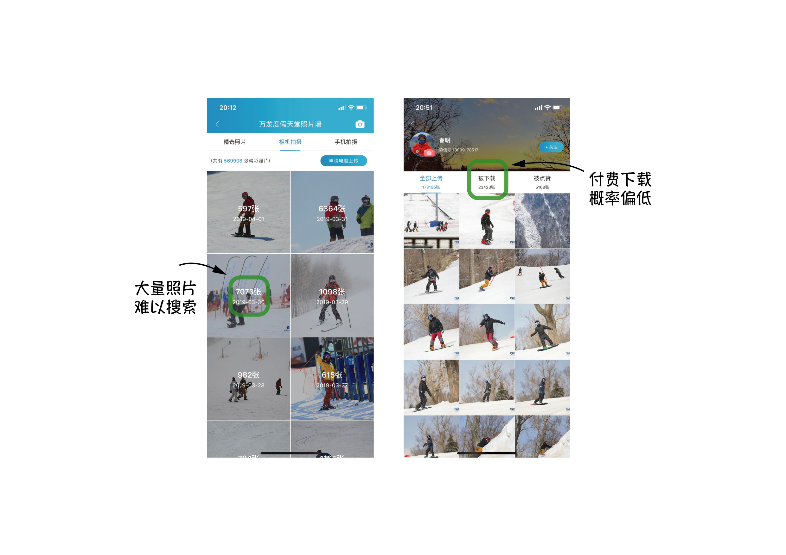
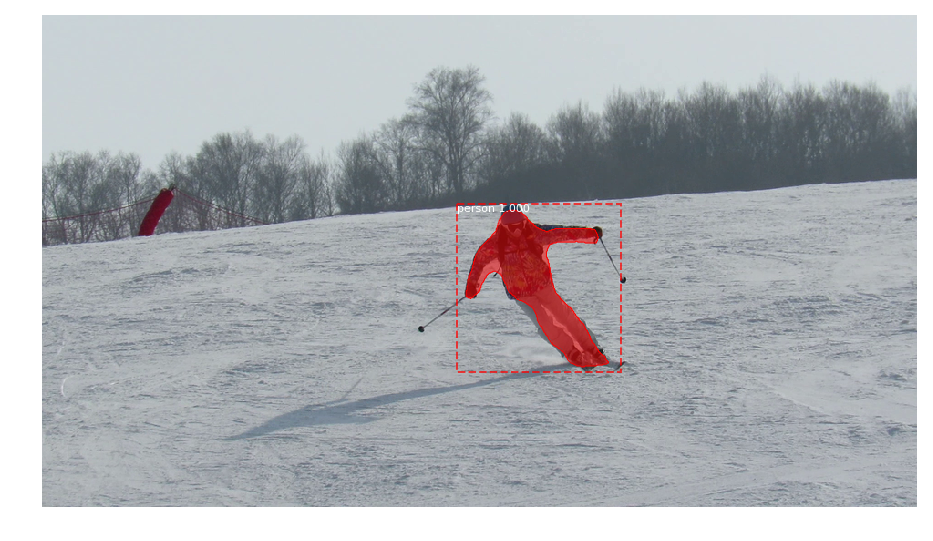
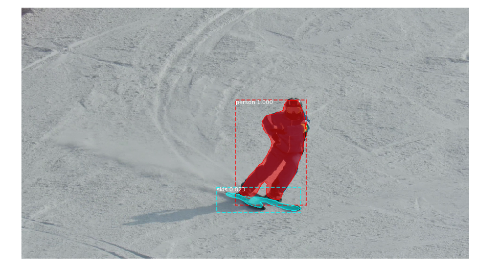
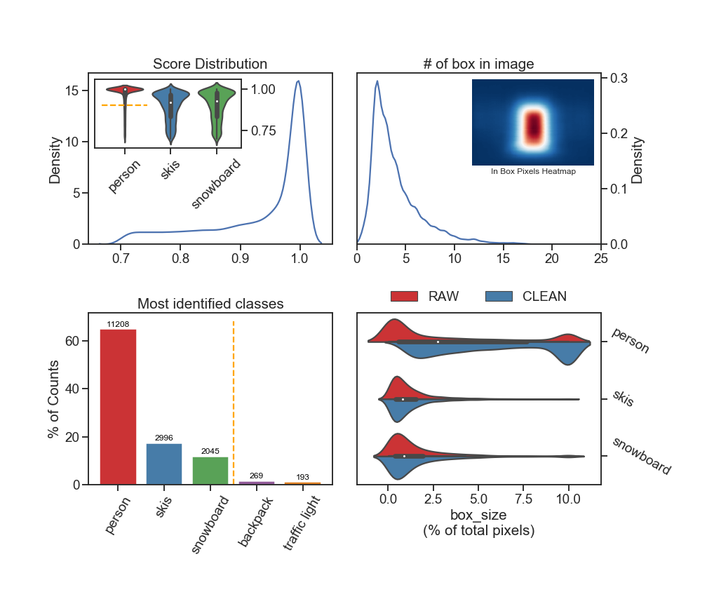

# SkierFinder

## 源起

2019年3月31日，和 @MingxuanHu 一起在崇礼万龙滑雪场滑雪，他第一次使用“滑呗”APP记录滑雪数据。下午坐大巴车返京途中，我们看到有同行的雪友在微信分享自己的滑雪照片。

这些滑雪照片来自于“滑呗”APP的“照片墙”页面，实际上是摄影爱好者或雪场摄影师将自己的作品上传到“滑呗”APP的。广大雪友根据自己的所在**雪场**、**是否观察到有摄影师拍摄自己的滑行**、被拍摄的大概**时间**，来找到自己的照片（当然，也可以下载其他雪友照片和风景照片，不在本文讨论范围）。“滑呗”APP提供的照片带有大量水印，若想下载无水印、高清、超清照片，需支付一定（约5元、15元、25元）的费用，“滑呗”APP和摄影师 3:7 分成。由于雪友属于社交性质较强的的社群，且消费水平普遍较高，这个产品不仅可以产生广告效应进而扩大用户群，也可以为“滑呗”APP带来一定的收益，还能创造其他潜在的商业价值（雪场广告效应、雪场流量数据、用户浏览数据等）。



但是，雪友的滑雪水平理论上符合正态分布，意味着多数雪友并不具备高超的滑雪水平。因此，在摄影师经常出没的高级道（如崇礼万龙滑雪场的大奔头）上，虽然能够诞生很好的摄影作品，但通常被摄目标有限<sup>fig</sup>，进而导致摄影师的收入有限。摄影师显然也注意到这一点，因此他们通常还会去其他相对简单的**中级雪道**、**缆车**沿线、山顶或山脚**集合地**等位置进行拍摄<sup>fig</sup>。但由于雪友水平限制（注意力高度集中在滑行上）或这些位置的特点（摄影师隐蔽、人员嘈杂等），导致**雪友很难观察到有摄影师拍摄自己**。最终，多数有意愿获得自己照片的雪友将不得不**从众多照片中手动找寻自己**。以2019年3月31日（周日）为例，崇礼万龙滑雪场就产生了**六千多张**照片，我们有理由认为，___从“照片墙”上大量照片中找到自己的过程非常困难，是此产品成交率低的重要原因之一___。因此，**如何高效找到特定雪友的照片**，是提高雪友付费概率的重要环节。



## 思路

**如何高效找到特定雪友的照片**，这个问题可以被分解为以下几步：
1. 在大量照片中找出每张照片中的每个滑雪者；
2. 提取每个滑雪者的特征，建立数据库；
3. 用户上传一张自己的照片，提取特征后与数据库进行匹配；
4. 返回匹配度高的照片给滑雪者挑选。

我们的想法是利用最先进的（state-of-art）、基于人工智能的图像识别技术，帮助我们高效、准确的完成这个“**寻找 -> 提取 -> 匹配**”的过程。

（在我当前微薄的知识储备下认为）其中可能涉及到的技术、人工智能算法、模型和结果主要有：

0. 可以通过爬虫等方式，获取“滑呗”APP上一定量的低清晰度照片
    - 爬虫
        - 发现一个相关 [repo](https://github.com/longquanwu/huabei)（已克隆）
    - 其他
        - 抓包 by @MingxuanHu
            - Update: 2019.04.02 抓包失败了
1. 在大量照片中找出每张照片中的每个滑雪者
    - 物体识别（Object Detection）和 图像分割（Image Segmentation）
        - 模型：[Mask R-CNN](https://github.com/matterport/Mask_RCNN)、[YOLO](https://pjreddie.com/darknet/yolo/)
        - 数据库：[COCO](http://cocodataset.org/#home)
        - **优点**：模型比较成熟
        - **缺点**：我不太熟悉，尝试后可以上手
2. 提取每个滑雪者的特征，建立数据库
    - 特征工程
        - 不同颜色像素的比例
        - **优点**：非常简单
        - **缺点**：不准确
    - 卷积神经网络提取特征
        - 区分单板/双板
        - 区分男女
        - **优点**：简单，我现在可以上手
        - **缺点**：依赖人工标注，功能有限
    - 非监督学习、降维、聚类
        - Autoencoder
        - PCA & tSNE
        - **优点**：我现在可以上手
        - **缺点**：效率低，每次新加入数据，就需要重新跑一遍
    - 姿态识别（Pose Estimation）
        - 根据姿势区分雪服/雪裤
        - 根据姿势区分单板/双板
        - **优点**：模型相对成熟
        - **缺点**：我完全不了解
3. 用户上传一张自己的照片，提取特征后与数据库进行匹配
    - 与 2 类似，但有区别
        - 摄影角度差别很大
4. 返回匹配度高的照片给滑雪者挑选
    - 容忍假阳性
    - 抗拒假阴性
    - 处理不匹配照片的方式很棘手
5. 结果
    - 成功跑通流程，成立公司与“滑呗”接触，提高准确度，投入商业化，赚钱（白日梦）
    - 边学边玩、纯玩、烂尾（这个靠谱）

---

## 上手

### TODO
#### 数据获取
- [x] [爬虫](#获取滑雪照片)
#### 特征提取
- [x] [使用 Mask R-CNN 提取特征](#提取每个滑雪者的特征)
- [ ] 海量照片高效提取
- [ ] 高效结果存储
#### 特征分析
- [x] [基本分析](#初步分析)
- [ ] 降维、聚类
- [ ] 卷积神经网络分类
- [ ] 运用其他模型
    - 姿态识别 [awesome](https://github.com/cbsudux/awesome-human-pose-estimation)
    - DeepFashion: [中文介绍](https://www.jianshu.com/p/3fceb8d84a2d)
#### NEXT
- [ ] TAD-HEAD
- [ ] 下一步计划中......
- [ ] 尝试布置计划到[看板](https://github.com/chAwater/SkierFinder/projects)

---

### 获取滑雪照片

Folder: `from_fenxuekeji`

- 利用找到的API尝试get照片 [`01.Test_API_get_img.py`](./from_fenxuekeji/01.Test_API_get_img.py)
- 获取一定量的照片URL [`02.Scraping_urls.py`](./from_fenxuekeji/02.Scraping_urls.py)
- 下载照片 [`download_urls.sh`](./utils/download_urls.sh)
    - @MingxuanHu 写的 Java 脚本暴力爬，竟然没被ban（上家技术还需要提高）

### 在照片中找出每个滑雪者

- 配置 Mask R-CNN 运行环境 [`setup_MaskRCNN.sh`](./utils/setup_MaskRCNN.sh)
- 测试 Mask R-CNN [`demo.ipynb`](https://github.com/matterport/Mask_RCNN/blob/master/samples/demo.ipynb)
- 在单反相机照片和用API手动get的照片上测试 Mask R-CNN ( based on `demo.ipynb` )

效果比想象中的好（模型能够准确识别出雪板！有些照片单板双板直接可以区分！（`skis` / `snowboard`））：

<html>
    <table style="margin-left: auto; margin-right: auto;" align="center">
        <tr>
            <th> ST_01 （相机照片，模型未检测到雪板）</th>
            <th> ST_02 （相机照片，模型检测到雪板）  </th>
        </tr>
        <tr>
            <td>  </td>
            <td>  </td>
        </tr>
    </table>
</html>

```python
class InferenceConfig(coco.CocoConfig):
    # To reduce memory usage when running on MacBookPro
    MAX_GT_INSTANCES = 20
    IMAGE_MAX_DIM = 512
    IMAGE_MIN_DIM = 512

# Load image
# image = skimage.io.imread('./SnapData/SingleTarget/ST_01.png')

# To reduce memory usage when running on MacBookPro
from PIL import Image
image = np.array(
    Image.open('./SnapData/SingleTarget/ST_01.png')
    .resize( (960,540), Image.ANTIALIAS )
)

# Run detection
results = model.detect([image], verbose=1)

# Visualize results
r = results[0]
visualize.display_instances(image, r['rois'], r['masks'], r['class_ids'],
                            class_names, r['scores'])
```

### 提取每个滑雪者的特征

- 从 Mask R-CNN 的模型输出提取信息
    1. 保存每个照片每个对象的 box, mask, class, scores 为 [**DataFrame**](#DataFrame)
        - 一个显卡（Titan X）约30分钟就处理完了4000张照片
        - 原始结果保存成 .pkl 文件大小约 6G，找到 ~17k 个 Box
        - 高效结果存储（#TODO）
        - 调整`batch_size`实现更高效的图片处理（#TODO）
        - 更大量的图片处理（#TODO）
    2. [**初步分析**](#初步分析)所有图片的结果
        - Score 分布
        - 每个照片的 Box 数量分布
            - RawData:   Median=3
            - CleanData: Median=2
        - Class 数量分布
        - BoxSize 分布
    3. 保留有意义的信息 **CleanData**
        - Class in ['person', 'skis', 'snowboard']
        - Score > 0.7
        - Person's Score > 0.9
        - Person's BoxSize > 1% ImageSize
        （删掉非被摄主体，“抢镜头”的人很多很多）
        - 使用上面的参数删掉了 ~40% 的 Box
        - CleanData保存成 .pkl 文件大小约 3G，保留 ~10k 个 Box
- 用提取的信息构建数据库 **#TAG-HEAD**
    - 数据库设计
        - 设计数据库结构
        - 如何验证？
        - 如何快速可视化结果？
    - 特征工程
        - 不同颜色像素的比例
    - 卷积神经网络
        - 利用 Mask R-CNN 输出作为标记，训练 CNN 区分单板/双板
    - 非监督学习、降维、聚类
        - PCA & tSNE
        - Autoencoder
    - 姿态识别
    - etc.


#### DataFrame

<table border="1" class="dataframe">
  <thead>
    <tr style="text-align: right;">
      <th></th>
      <th>class</th>
      <th>scores</th>
      <th>rois</th>
      <th>box_size</th>
      <th>masks</th>
      <th>imgID</th>
    </tr>
  </thead>
  <tbody>
    <tr>
      <th>0</th>
      <td>person</td>
      <td>0.999791</td>
      <td>[244, 614, 400, 684]</td>
      <td>3.340471</td>
      <td>[False, False, False, False, False, False, ...</td>
      <td>0</td>
    </tr>
    <tr>
      <th>1</th>
      <td>person</td>
      <td>0.999780</td>
      <td>[211, 299, 344, 432]</td>
      <td>5.411135</td>
      <td>[False, False, False, False, False, False, ...</td>
      <td>0</td>
    </tr>
    <tr>
      <th>2</th>
      <td>snowboard</td>
      <td>0.991058</td>
      <td>[320, 268, 365, 417]</td>
      <td>2.051086</td>
      <td>[False, False, False, False, False, False, ...</td>
      <td>0</td>
    </tr>
    <tr>
      <th>3</th>
      <td>skis</td>
      <td>0.944588</td>
      <td>[384, 622, 404, 686]</td>
      <td>0.391557</td>
      <td>[False, False, False, False, False, False, ...</td>
      <td>0</td>
    </tr>
    <tr>
      <th>4</th>
      <td>person</td>
      <td>0.900126</td>
      <td>[221, 138, 249, 156]</td>
      <td>0.154176</td>
      <td>[False, False, False, False, False, False, ...</td>
      <td>0</td>
    </tr>
  </tbody>
</table>

#### 初步分析




### 根据上传的照片进行匹配

### 结果评估


##### Version

|    Obj     | Version |  Note  |
|    :-:     |   :-:   |   :-:  |
|   滑呗 APP  | v3.4.1  |   iOS  |
| Mask R-CNN |  v2.1   |    -   |
|   Python   |   3.7   |   3.5  |
|   Pandas   |  v0.24  |  v0.23 |

<!-- EOF -->
