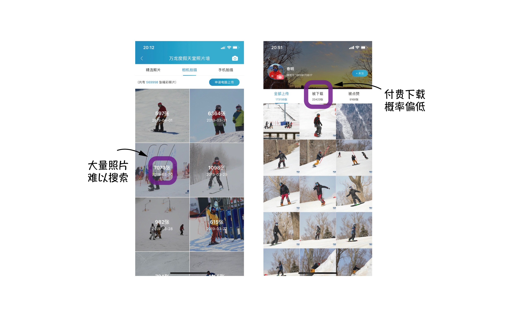
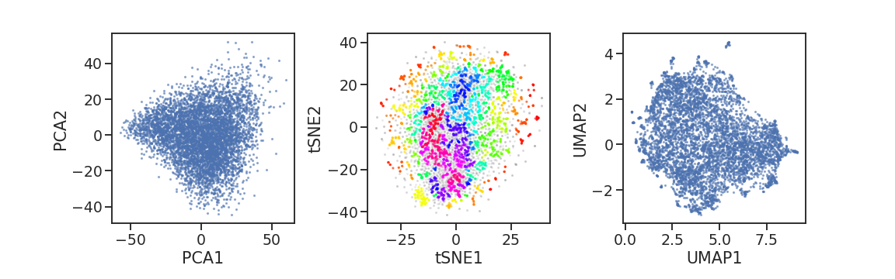

# SkierFinder

## 源起

2019年3月31日，和 @MingxuanHu 一起在崇礼万龙滑雪场滑雪，他第一次使用“滑呗”APP记录滑雪数据。下午坐大巴车返京途中，我们看到有同行的雪友在微信分享自己的滑雪照片。

这些滑雪照片来自于“滑呗”APP的“照片墙”页面，实际上是摄影爱好者或雪场摄影师将自己的作品上传到“滑呗”APP的。广大雪友根据自己的所在**雪场**、**是否观察到有摄影师拍摄自己的滑行**、被拍摄的**大概时间**，来找到自己的照片（当然，也可以下载其他雪友照片和风景照片，不在本文讨论范围）。“滑呗”APP提供的照片带有大量水印，若想下载无水印、高清、超清照片，需支付一定（约5元、15元、25元）的费用，“滑呗”APP和摄影师 3:7 分成。由于雪友属于社交性质较强的的社群，且消费水平普遍较高，这个产品不仅可以产生广告效应进而扩大用户群，也可以为“滑呗”APP带来一定的收益，还能创造其他潜在的商业价值（雪场广告效应、雪场流量数据、用户浏览数据等）。

但是，雪友的滑雪水平理论上符合正态分布，意味着多数雪友并不具备高超的滑雪水平。因此，在摄影师经常出没的高级道（如崇礼万龙滑雪场的大奔头）上，虽然能够诞生很好的摄影作品，但通常被摄目标有限fig，进而导致摄影师的收入有限。摄影师显然也注意到这一点，因此他们通常还会去其他相对简单的**中级雪道**、**缆车**沿线、山顶或山脚**集合地**等位置进行拍摄fig。但由于雪友水平限制（注意力高度集中在滑行上）或这些位置的特点（摄影师隐蔽、人员嘈杂等），导致**雪友很难观察到有摄影师拍摄自己**。最终，多数有意愿获得自己照片的雪友将不得不**从众多照片中手动找寻自己**。以2019年3月31日（周日）为例，崇礼万龙滑雪场就产生了**六千多张**照片，我们有理由认为，___从“照片墙”上大量照片中找到自己的过程非常困难，是此产品成交率低的重要原因之一___。因此，**如何高效找到特定雪友的照片**，是提高雪友付费概率的重要环节。

## 思路

**如何高效找到特定雪友的照片**，这个问题可以被分解为以下几步：
1. 在大量照片中找出每张照片中的每个滑雪者；
2. 提取每个滑雪者的特征，建立数据库；
3. 用户上传一张自己的照片，提取特征后与数据库进行匹配；
4. 返回匹配度高的照片给滑雪者挑选。

我们的想法是利用最先进的（State-of-art）、基于人工智能的图像识别技术，帮助我们高效、准确的完成这个“**寻找 -> 提取 -> 匹配**”的过程。

（:beginner: 在我当前微薄的知识储备下认为）其中可能涉及到的技术、人工智能算法、模型和结果主要有：

0. 可以通过爬虫等方式，获取“滑呗”APP上一定量的低清晰度照片
    - 爬虫
        - 发现一个相关 [repo](https://github.com/longquanwu/huabei)（已克隆）
    - 其他
        - 抓包 by @MingxuanHu
            - Update: 2019.04.02 抓包失败了
1. 在大量照片中找出每张照片中的每个滑雪者
    - 物体识别（Object Detection）和 图像分割（Image Segmentation）
        - 模型：[Mask R-CNN](https://github.com/matterport/Mask_RCNN)、[YOLO](https://pjreddie.com/darknet/yolo/)；数据库：[COCO](http://cocodataset.org/#home)
        - **优点**：模型高度成熟；**缺点**：不太熟悉，需要测试；
2. 提取每个滑雪者的特征，建立数据库
    - 特征工程
        - 不同颜色像素的比例
        - **优点**：非常简单； **缺点**：不准确；
    - 卷积神经网络提取特征
        - 区分单板/双板；区分男女
        - **优点**：简单；**缺点**：依赖人工标注，工作量大，功能有限；
    - 非监督学习、降维、聚类
        - PCA & tSNE & Autoencoder
        - **优点**：简单；**缺点**：效率低，每次新加入数据，就需要重新跑一遍；
    - 姿态识别（Pose Estimation）
        - 根据姿势区分雪服/雪裤；区分单板/双板
        - **优点**：模型比较成熟，提取额外特征；**缺点**：完全不了解，需要学习；
3. 用户上传一张自己的照片，提取特征后与数据库进行匹配、索引
    - 与上一步类似，但有区别
        - 摄影角度差别很大，信息完整度有差别（相比于滑行中，头、脸、腿信息可能不完整）
4. 返回匹配度高的照片给滑雪者挑选
    - 容忍假阳性；抗拒假阴性；
    - 处理非被摄主题匹配照片的方式很棘手
5. 结果
    - 成功跑通流程，成立公司与“滑呗”接触，提高准确度，投入商业化，赚钱（白日梦 :heart_eyes: ）
    - 边学边玩、纯玩、烂尾（这个靠谱 :sunglasses: ）

---

## 上手

### TODO

#### 数据获取
- [x] [爬虫](#获取滑雪照片)
    - [ ] 如何获得 API :warning:
- [ ] 其他渠道获取照片 :zzz:

#### 特征提取
- [x] [使用 Mask R-CNN 提取特征](#提取每个滑雪者的特征)
    - [x] [海量照片高效提取](./bulk_run/README.md) :pushpin:
    - [x] 高效结果存储
    - [x] 结果可视化重现 [`Show_Img`](./utils/Tools.py#L61)
- [x] [卷积神经网络进一步提取特征](#用提取的信息构建数据库)
    - [x] ResNet50    提取滑雪者所在 Box
    - [ ] ResNet50    提取滑雪者所在 Mask :zzz:
    - [x] DenseNet201 提取滑雪者所在 Box
    - [x] VGG19       提取滑雪者所在 Box
- [ ] 运用其他模型提取特征
    - [ ] 常规 CV 算法
    - [ ] 姿态识别 [awesome](https://github.com/cbsudux/awesome-human-pose-estimation)
    - [ ] DeepFashion: [中文介绍](https://www.jianshu.com/p/3fceb8d84a2d)
    - [ ] etc.

#### 特征分析
- [x] [基本分析](#初步分析)
- [ ] 像素分析，特征工程，CV :zzz:
- [x] [降维、聚类](#降维展示)
- [ ] 卷积神经网络分类

#### 图像索引
- [ ] 构建数据库
- [ ] 构建用户上传图片
- [ ] 基于图像变换（Argument）检测索引成功率
- [ ] 基于大量图片的索引检测
    - [ ] 在多个时间点寻找同一个滑雪者
    - [ ] 寻找类似雪服的滑雪者

#### NEXT
- [ ] 尝试布置计划到[看板](https://github.com/chAwater/SkierFinder/projects)
- [ ] 下一步计划中......

#### TAG
|     TAG Name      | TAG emoji |
|        :-:        |    :-:    |  
|     HEAD-TODO     | :pushpin: |
|     CHECKPOINT    | :anchor:  |
|       FOLK        | :arrow_heading_down: :leftwards_arrow_with_hook: :twisted_rightwards_arrows:|
|    FINE-TUNING    | :construction: :musical_note: |
|      QUESTION     | :question: |
|     LOOSE-END     | :curly_loop: :end: |

---

### 获取滑雪照片

Folder: `from_fenxuekeji`

- 利用找到的API尝试get照片 [`01.Test_API_get_img.py`](./from_fenxuekeji/01.Test_API_get_img.py)
- 获取一定量的照片URL [`02.Scraping_urls.py`](./from_fenxuekeji/02.Scraping_urls.py)
- 下载照片 [`download_urls.sh`](./utils/download_urls.sh)
- 其他 :warning:
    - 担心 API 发生变化，影响与公司合作前的时间窗口
    （不能过分依靠好运气得到的API :sunglasses: ）
    - 上家技术还需要提高 :worried:
        - @MingxuanHu 写的 Java 脚本暴力爬，搞了几个G竟然没被ban
        - 同一张照片有各种大小
            - 应该是为了APP的小图预览（我下载了大照片）
            - 有不同大小的照片，因此可以用AI增加分辨率
            - 没有关注原始图像能否直接获取 :imp:
        - 小照片没水印，大照片有水印
            - 所有照片水印都是一样的，因此可以用AI去掉 :smiling_imp:
    - 不过既然吃了上家资源又要赚上家钱，就不坑上家了 :grimacing:

---

### 在照片中找出每个滑雪者

- 配置 Mask R-CNN 运行环境 [`setup_MaskRCNN.sh`](./utils/setup_MaskRCNN.sh)
    - 除 [imgaug](https://github.com/aleju/imgaug), [pycocotools](https://github.com/cocodataset/cocoapi) 以外，其他为常用包
    （:beginner: 来自于不做CV的无知 :mask: ）
- 测试 Mask R-CNN [`demo.ipynb`](https://github.com/matterport/Mask_RCNN/blob/master/samples/demo.ipynb)
- 在单反相机照片和用API手动get的照片上测试 Mask R-CNN ( based on `demo.ipynb` )
    - 效果比想象中的好！:v:
    - 有些照片模型能够识别出雪板！单板双板直接可以区分！
    :ski:`skis` /:snowboarder:`snowboard`

<html>
    <table style="margin-left: auto; margin-right: auto;" align="center">
        <tr>
            <th> ST_01 （相机照片，模型未检测到雪板）</th>
            <th> ST_02 （相机照片，模型检测到雪板）  </th>
        </tr>
        <tr>
            <td>  </td>
            <td>  </td>
        </tr>
    </table>
</html>

---

### 提取每个滑雪者的特征

Folder: `analysis`

#### 从 Mask R-CNN 的模型输出提取信息

[`01.Mask_RCNN_result_analysis.py`](./analysis/01.Mask_RCNN_result_analysis.py)

1. 保存每个照片每个对象的 box, mask, class, scores 为 [**DataFrame**](#DataFrame)
    - 约30分钟就处理完了4000张照片 :zap:
    - 原始结果保存成 .pkl 文件大小约 6G，找到 ~17k 个 Box
    - [更大量图片的高效处理](#大量图片高效处理) :twisted_rightwards_arrows:
2. [**初步分析**](#初步分析)所有图片的结果
    - Fig1 Score 分布
        - 整体：0.7~1.0
        - 人：~1.0
        - 雪板：0.7~1.0
    - Fig2 每个照片的 Box 数量分布
        - RawData:   Median=3
        - CleanData: Median=2
        - 对象多处在图片正中央
            - 摄影中的黄金分割不见了
            - 可能和运动摄影的速度要求有关
            （焦点在中央以减少“对焦到按下快门”时间 :sunglasses: ）
    - Fig3 Class 数量分布
        - 主要对象为人和雪板
        - 其他类别的鉴定可认为是“错误”忽略
    - Fig4 BoxSize 分布：见图
3. 保留有意义的信息 **CleanData**
    - Class in ['person', 'skis', 'snowboard']
    - Score > 0.7
    - Person's Score > 0.9
    - Person's BoxSize > 1% ImageSize
        - 删掉非被摄主体
        - 平均 ~3人/照片
        （“抢镜头”的人很多很多，还是应该说这个模型真:ox::beer:）
    - 使用上面的参数删掉了 ~40% 的 Box
    - CleanData保存成 .pkl 文件大小约 3G，保留 ~10k 个 Box

:anchor: :anchor: :anchor: :anchor: :anchor: :anchor: :anchor:
:anchor: :anchor: :anchor: :anchor: :anchor: :anchor: :anchor:
:anchor: :anchor: :anchor: :anchor: :anchor: :anchor: :anchor:

#### 用提取的信息构建数据库

[`02.Extract_features_from_InBoxPixels.py`](analysis/02.Extract_features_from_InBoxPixels.py)

1. 从原始图像中提取出 InBox Pixels
    - 函数： [`extInBoxPixels`](./utils/Tools.py#L150)
        - 提取 InBox  Pixels
        - 提取 InMask Pixels :zzz:
    - 只提取滑雪者，雪板暂时忽略
    - [BoxSize Distribution](./imgs/BoxSize.png)
2. 固定提取出的 BoxSize
    - 函数 [`squareBox`](./utils/Tools.py#L212)
    - 等比缩放，填充白色
    - shape = (150, 150, 3)
3. 卷积神经网络进一步提取 InBox Pixels 的特征 :arrow_heading_down:
    - 函数 [`extInBoxPixels`](./utils/Tools.py#L150)
    - 模型：`VGG19` `ResNet50` `DenseNet201`
    - 每个滑雪者转换为一个 2048 维向量，保存
    - 聚类时是否要做 Normalization :question:
    - References
        - [repo](https://github.com/willard-yuan/flask-keras-cnn-image-retrieval) | [Issue](https://github.com/willard-yuan/flask-keras-cnn-image-retrieval/issues/4) | [Issue](https://github.com/willard-yuan/flask-keras-cnn-image-retrieval/issues/24)
4. 特征分析 :zzz:
    - 对 DenseNet201 提取出的特征向量降维、聚类
        - 使用三种算法降维（PCA, tSNE, UMAP）[低维展示](#降维展示)
        - 手动选择一簇低维空间中的点，可视化其 InBox Pixels 和原始图片
            - 选择了 UMAP 二维空间中最上面中间偏右的那一簇数据点
                - 结果很好，目标几乎是同一个人
                - ResNet50 的结果有一个不是，可能是那一簇旁边的那个点
        - 使用 HDBSCAN 聚类 [低维展示](#降维展示)
            - 以 tSNE 结果为例
            - 参数需要微调，结果不稳定，不理想 :construction:
                - 有的聚类项目太多无意义
                - 有的聚类不是由滑雪者雪服聚出来的，而是动作+雪花
                - 有的聚类包含两个类似的滑雪者
                - 有的多个聚类属于同一个滑雪者
        - 需要进一步学习提高 :curly_loop: :end:
5. 构建数据库

:pushpin:

:leftwards_arrow_with_hook:

- TODO outline **#TAG-FOLK**
    - 数据库设计
        - 设计数据库结构
        - 如何验证？
        - 如何快速可视化结果？
    - 卷积神经网络
        - 利用 Mask R-CNN 输出作为标记，训练 CNN 区分单板/双板
    - 姿态识别
    - etc.

---

### 根据上传的照片进行匹配

- 在上传的照片上运行特征提取
    - Mask R-CNN
    - DenseNet201
- 在数据库中搜索类似的滑雪者
    - 用向量点乘（余弦相似度）来搜索相近的向量
    - 根据相似度排序数据库中的图片
    - 返回图片排序

:pushpin:

### 结果评估

---

### 细节

#### DataFrame

<table border="1" class="dataframe">
  <thead>
    <tr style="text-align: right;">
      <th></th>
      <th>class</th>
      <th>scores</th>
      <th>x1</th>
      <th>y1</th>
      <th>x2</th>
      <th>y1</th>
      <th>box_size</th>
      <th>masks</th>
      <th>imgID</th>
    </tr>
  </thead>
  <tbody>
    <tr>
      <th>0</th>
      <td>person</td>
      <td>0.999791</td>
      <td>244</td>
      <td>614</td>
      <td>400</td>
      <td>684</td>
      <td>3.340471</td>
      <td>000000...</td>
      <td>./path/to/imgs/0.jpg</td>
    </tr>
    <tr>
      <th>1</th>
      <td>person</td>
      <td>0.999780</td>
      <td>211</td>
      <td>299</td>
      <td>344</td>
      <td>432</td>
      <td>5.411135</td>
      <td>000000...</td>
      <td>./path/to/imgs/0.jpg</td>
    </tr>
    <tr>
      <th>2</th>
      <td>snowboard</td>
      <td>0.991058</td>
      <td>320</td>
      <td>268</td>
      <td>365</td>
      <td>417</td>
      <td>2.051086</td>
      <td>000000...</td>
      <td>./path/to/imgs/0.jpg</td>
    </tr>
    <tr>
      <th>3</th>
      <td>skis</td>
      <td>0.944588</td>
      <td>384</td>
      <td>622</td>
      <td>404</td>
      <td>686</td>
      <td>0.391557</td>
      <td>000000...</td>
      <td>./path/to/imgs/1.jpg</td>
    </tr>
    <tr>
      <th>4</th>
      <td>person</td>
      <td>0.900126</td>
      <td>221</td>
      <td>138</td>
      <td>249</td>
      <td>156</td>
      <td>0.154176</td>
      <td>000000...</td>
      <td>./path/to/imgs/1.jpg</td>
    </tr>
  </tbody>
</table>

#### 初步分析

#### 降维展示

##### Version

|    Obj     | Version |  Note  |
|    :-:     |   :-:   |   :-:  |
|   滑呗 APP  | v3.4.1  |   iOS  |
| Mask R-CNN |  v2.1   |    -   |
|   Python   |   3.7   |   3.5  |
|   Pandas   |  v0.24  |  v0.23 |
|    Keras   | v2.2.4  | v2.1.3 |
|    CUDA    |  v10.1  |  v8.0  |

<!-- EOF -->
