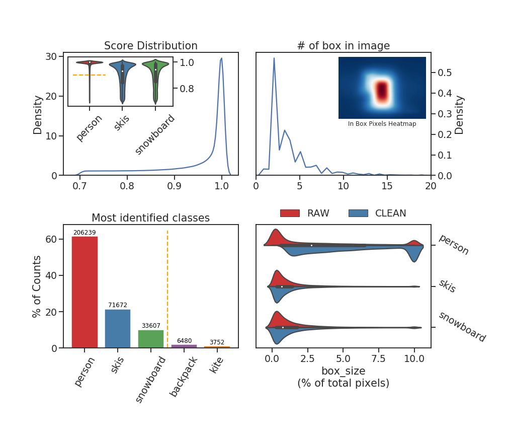
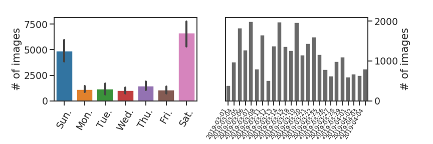

# 大量图片高效处理

## 在照片中找出每个滑雪者

### 流程和细节优化
- Mask R-CNN
    - 跑完了万龙滑雪场 20190301 ~ 20190404 的照片
    - 共 86573 张照片 :muscle:
    - @MingxuanHu 爬来的数据 :clap:
- 多线程
    - 多线程读取图片
    - 多线程格式化数据
- 使用GPU
    - 图片处理速度提高 ~40x :rocket:
    - Titan X Pascal
        - `A 12GB GPU can typically handle 2 images of 1024x1024px`
    - 调整 `batch_size`
        - 2x GPU
        - 6x Image/GPU (700x467px, ~30%)
    - Tips [`tips_for_GPU.sh`](../utils/tips_for_GPU.sh)
- 高效结果存储
    - 减少空间使用 :floppy_disk:
        - **Masks**
            - Lists -> Strings
        - ROIs
            - Lists -> 4x Int
        - 减少 90% 内存消耗
            - `df.info(memory_usage="deep")`
    - Save DataFrame per batch
- 合并数据
    - 保存为**csv** :ledger:
        - 方便合并
        - 支持分 chunk 读取
    - 压缩
        - 压缩比很高，1000x
        - 因此压缩后的 csv 比 pkl 小多了
        - 可能因为Masks的数据类型0/1

### 数据分析

#### 初步分析 Mask R-CNN 结果
- Fig1 Score 分布
- Fig2 每个照片的 Box 数量、位置分布
- Fig3 Class 数量分布
- Fig4 BoxSize 分布

整体结果和周末一天的数据相比 [image](../imgs/Mask_RCNN_result_analysis.png)，只有 Fig2 有较大区别；在大量图片的结果中，可以明显看到多数图片中只有 1~2 个对象，猜测可能是因为周末雪场人多导致每张图片中有很多“抢镜头”的雪友。因此分析了平均每张照片中的滑雪者数量，但是周末和工作日的差别并不明显，有点儿奇怪，也可能是 KDE 画图的问题，不予深究。

#### 时间分析

- 临近雪季末
    - 每天的照片数随时间变化趋势（除去周末）
- 工作日和周末
    - 每周每一天（星期X）的平均照片数
    - 平均每张照片中的滑雪者数量

## 提取每个滑雪者的特征并建立数据库

### 特征提取
- 提取滑雪者的 InMask Pixels [`extInBoxPixels`](./utils/Tools.py#L150)
- 固定提取出的 BoxSize 150x150 [`squareBox`](./utils/Tools.py#L212)
- 卷积神经网络提取特征
    - VGG19
    - ResNet50
    - DenseNet201
- 保存提取出的特征向量

### 数据库构建

:pushpin:#TODO

<!--  -->
